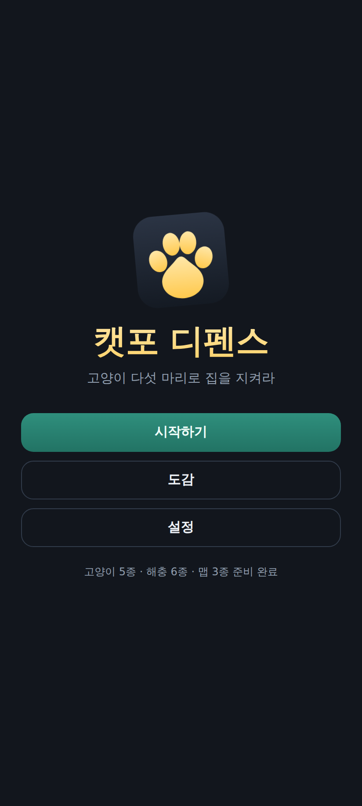
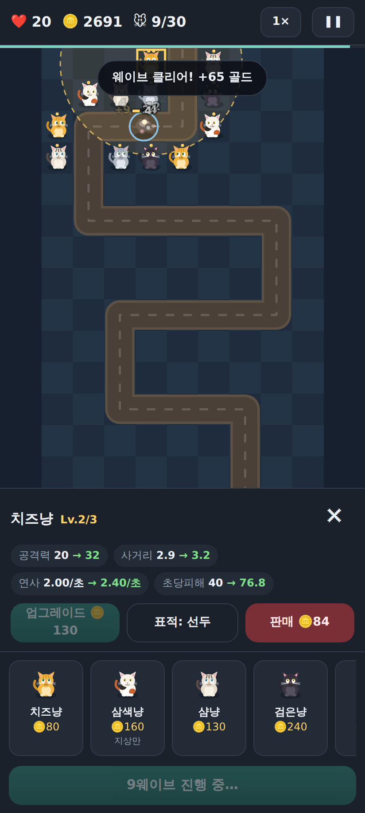
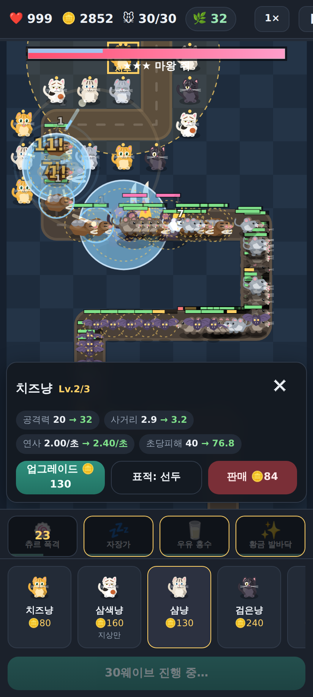
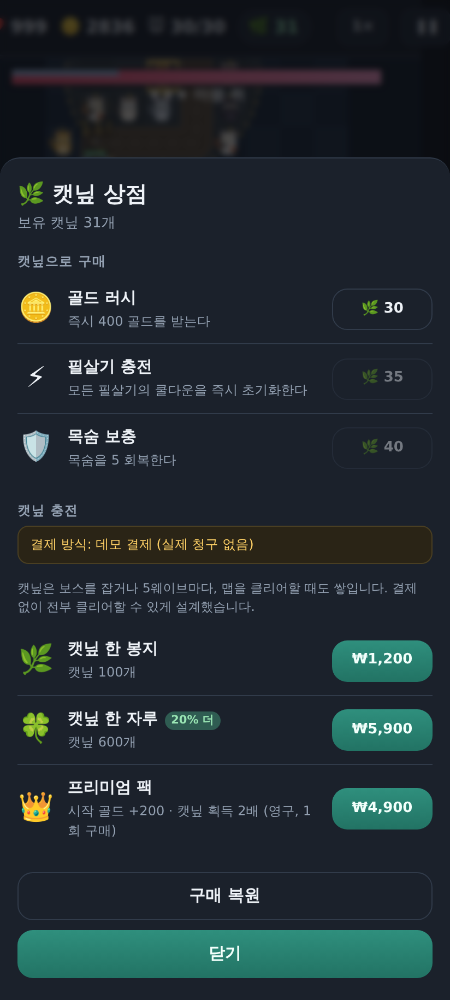

# 🐾 캣포 디펜스 (Catpaw Defense)

고양이 아홉 마리로 집을 지키는 타워디펜스. **HTML5 Canvas + PWA + 안드로이드 WebView 앱.**

의존성 0개 — 게임 코드는 순수 바닐라 JS ES 모듈이다. 효과음과 배경음은 오디오 파일 없이
WebAudio 오실레이터로 그 자리에서 만들어낸다.

캐릭터는 프레임 스트립 PNG 로 그린다 — 고양이 5마리는 5장(발사 순간 · 되돌아옴 ·
거의 제자리 · 대기 · 자는 중), 해충 14종은 3장(걷기 A · 걷기 B · 멈춤).
**그림이 없거나 로드에 실패하면 캔버스 도형으로 떨어져 게임이 그대로 돌아간다** —
그래서 캐릭터 그림을 한 장씩 넣을 수 있다.

지도도 같다. 길과 막힌 칸은 `CanvasPattern` 으로 칠하므로 **경로 기하는 한 글자도
바뀌지 않는다** — 길 그림이 실제 경로와 어긋나는 사고가 구조적으로 일어나지 않는다.

| 타이틀 | 전투 | 최종 보스 | 상점 |
|---|---|---|---|
|  |  |  |  |

**공식 사이트 (받는 곳)** — <https://kimd10041004-gif.github.io/-catpaw-defense/>

| | |
|---|---|
| **안드로이드** | APK 한 번 탭 ([`docs/실기기설치.md`](docs/실기기설치.md)) |
| **아이폰·아이패드·브라우저** | [`/play/`](https://kimd10041004-gif.github.io/-catpaw-defense/play/) — 설치하는 앱은 없다. 사파리에서 열고 홈 화면에 추가 ([`docs/아이폰.md`](docs/아이폰.md)) |

`/play/` 는 **유료 콘텐츠를 뺀 데모 빌드**다. `web/` 을 그대로 올리면 데모 결제가 3막·스킨 팩을 공짜로 열기
때문에, `tools/demo-build.mjs` 가 그 파일들을 빼고 굽는다 — 잠근 게 아니라 없다(`tests/node/demo.test.mjs`).
사이트 소스는 `site/`, 배포는 `.github/workflows/pages.yml`.

---

## 실행하는 3가지 방법

### 0) 파일 하나로 (가장 빠름 — 서버도 필요 없다)

```bash
node tools/bundle.mjs
# → dist/catpaw-defense.html  (220KB, 완전 독립)
```

브라우저로 그냥 열면 끝이다. ES 모듈 25개를 각자 함수 스코프로 감싸 합쳤기 때문에
`file://`에서도 CORS에 막히지 않는다. 폰에 파일을 넣어서 열어도 되고, 어디든 올려도 된다.

### 1) 웹에서 개발하며 (핫 리로드용)

```bash
npx --yes http-server web -p 8080 -c-1
# → http://localhost:8080
```

`file://`로 직접 열면 안 된다 — ES 모듈이 CORS로 막힌다. 반드시 HTTP로 서빙해야 한다.

### 2) 폰에 앱처럼 설치 (PWA)

위 서버를 폰과 같은 네트워크에서 띄우거나 GitHub Pages 등에 올린 뒤,
안드로이드 크롬에서 열고 **⋮ → 홈 화면에 추가**.

- 전체화면·세로 고정으로 실행된다 (주소창 없음)
- 서비스 워커가 모든 파일을 캐시해서 **비행기 모드에서도 그대로 돌아간다**

### 3) 진짜 APK

**폰에서 한 번 탭해서 (권장)** — [Releases](https://github.com/kimd10041004-gif/-catpaw-defense/releases) 의
`dev` 에 APK 두 개가 올라가 있다. 갱신하려면 Actions → `릴리스 (설치용 APK)` → Run workflow.

- `…-release.apk` (`com.catpaw.defense`) — **R8 이 켜진 진짜 빌드.** R8 이 뭘 잘못 지웠는지는 기기에서만 드러난다
- `…-debug.apk` (`com.catpaw.defense.debug`) — 릴리스와 나란히 깔리고 세이브도 따로다

키스토어 비밀이 없으면 둘 다 디버그 키로 서명되므로 "출처를 알 수 없는 앱 설치"만 허용하면 깔린다.
자세한 건 [`docs/실기기설치.md`](docs/실기기설치.md) — 설치 허용·ADB·`chrome://inspect` 로 폰 콘솔 보기까지.

**Actions 아티팩트로** — 아무 푸시에나 `catpaw-defense-release-apk` · `catpaw-defense-debug-apk` 가 남는다.
ZIP 으로 감싸이고 로그인이 필요해 폰에서는 위쪽이 낫다.

**Play 에 올리는 AAB** — 같은 실행의 `catpaw-defense-release-aab`. 저장소 비밀
`CATPAW_KEYSTORE_B64 · CATPAW_KEYSTORE_PW · CATPAW_KEY_ALIAS · CATPAW_KEY_PW` 가 있으면 그 키로,
없으면 디버그 키로 서명한다(빌드 검증용, Play 가 거부한다). 절차 전체는 `docs/출시체크리스트.md`,
개인정보처리방침은 `docs/개인정보처리방침.md`. compileSdk/targetSdk 36 · R8 · 리소스 축소 · 서비스 워커 배선은
**CI 에서 실제로 컴파일된다**(디버그 APK 8.5MB · 릴리스 AAB 6.1MB). 다만 **R8 이 뭘 잘못 지웠는지는 기기에서
돌려야만** 드러난다 — 그래서 릴리스 APK 를 같이 올린다.

**Android Studio로**
`android/` 폴더를 열고 Run. 또는 명령줄에서:

```bash
cd android
./gradlew assembleDebug
# → app/build/outputs/apk/debug/app-debug.apk
```

`web/` 폴더는 빌드할 때마다 Gradle이 자동으로 assets에 복사한다. 웹 코드를 고치면 APK에 그대로 반영된다.

---

## 게임 규칙

### 두 가지 모드

- **시나리오 18장 (1막 12장 + 2막 6장)** — 컷신으로 이어지는 캠페인. 장마다 주 목표 1개 + 부 목표 2개가
  있고 별을 최대 3개까지 받는다. 고양이 세 마리(샴냥·검은냥·뚱냥)가 2·4·6장 보상으로
  풀리고, 2막에서는 펫 두 마리(부엉이·너구리)가 14·17장 보상으로 온다. 맵을 18개 만들지 않고
  `waveSet`·`waveLimit` 으로 맵 6개 × 웨이브셋 8개를 조합한다
- **자유 모드** — 맵을 골라 끝까지 간다. 시나리오 기록과 서로 섞이지 않는다
  (시나리오 판은 맵의 최고 웨이브 기록을 건드리지 않는다). 다 막으면 **무한 모드**로 표 밖까지 이어 갈 수 있다
- **도전** — 한 번이라도 깬 자유 모드 맵에 규칙 하나를 얹어 다시 논다: 골드 절반 · 공중만 · 보스 2배 ·
  여섯 마리 · 맨손(필살기 없이). 첫 클리어에 캣닢. 도전 판은 최고 웨이브·해금·무한 기록을 건드리지 않는다
- **주간 도전** — 맵 목록 맨 위. ISO 주 키에서 맵·규칙·난수 시드가 정해져 **같은 주엔 모두 같은 판**이다
  (서버 없이). 첫 클리어 캣닢 25(프리미엄 2배). 자유 모드 기록은 안 건드린다. 순위표는 없다 — 지역 최고 기록만
- **훈련** — 도감에서 고양이마다 캣닢으로 영구 단계(3단계, 40·80·160)를 올린다. 단계당 공격 +5%. 봇 기준(`node tools/balance-sim.mjs --growth 3 --seed 7`) 만렙(+15%)은 골목길·부엌·지붕·창고를 100% 클리어로 만들고 지하실·다락방은 여전히 못 깬다 — 앞 맵을 편하게 할 뿐 끝판을 대신 깨 주지 않는다
  아홉 마리 전부 2,520 캣닢 — 캣닢의 장기 소비처다


목숨 20개로 시작한다. 해충이 길 끝까지 도달하면 목숨이 줄고, 0이 되면 진다. **30웨이브를 모두 막으면 승리.**

### 속성 6종 — 흙 · 번개 · 얼음 · 불 · 어둠 · 빛

고양이와 해충 모두 속성을 하나씩 갖는다. 여섯이 **하나의 고리**를 이루고, 각 속성은 고리의 다음 속성에게 강하다.

```
흙 → 번개 → 얼음 → 불 → 어둠 → 빛 → 흙        유리 ×1.5 · 무관 ×1.0 · 불리 ×0.7
```

빛과 어둠을 서로 강하게 두지 않은 이유가 있다. 그러면 그 둘만 약점이 없어지고, 고양이는 공격만 하므로
**약점 없는 속성이 언제나 정답**이 된다. 고리면 여섯 전부 강점 1 · 약점 1 · 무관 3 으로 대칭이다
(`elements.test` 가 이 대칭을 센다).

**상성은 원정 모드에서만 걸린다.** 자유 모드와 시나리오는 그대로다 — 맵을 깨고 나가는 길이 속성 수집에
걸리면 안 되기 때문이다(아래 과금 절의 무료 범위 약속과 같은 원칙). 도감에는 늘 배지로 보인다.

### 뽑기 — 확률을 공개한다

고양이 카드와 속성 룬을 뽑는다. 캣닢은 현금으로도 사므로 이 뽑기는 **확률형 아이템**이고,
한국 게임산업법이 확률 공개를 의무화한다(2024-03 시행).

그래서 **표를 두 벌 만들지 않았다.** `domain/gacha.js` 의 `GACHA_TABLE` 하나가 굴리는 표이자
화면에 뜨는 표다. `gacha.test` 가 셋을 고정한다 — 합이 정확히 1.0 · 화면 문구가 표에서 나온다 ·
**20만 번 굴린 실측이 표와 맞는다**. 마지막 것이 진짜 증거다.

약속 셋:

- **뽑기가 진행을 막지 않는다.** 고양이 9마리는 시나리오 보상으로 전부 무료다. 뽑기에서 나오는 건 그 위에 얹는 것뿐
- **빈손이 없다.** 중복 카드는 조각으로 녹는다
- **운이 나빠도 결국 도달한다.** 조각으로 *원하는* 카드를 사고, 10연에는 상위 등급이 보장된다

**티켓은 현금으로 못 산다.** 출석(하루 1장)과 원정 보상으로만 벌리고, 뽑기는 티켓부터 쓴다 —
"결제 없이도 모을 수 있다"는 약속이 뽑기까지 이어진다.

### 고양이 9종 (각 3레벨, 판매 시 투자금 60% 환급)

| 고양이 | 건설 | 특징 |
|---|---|---|
| 🧀 **치즈냥** | 80 | 빠른 연사. 싸고 무난하지만 두꺼운 장갑엔 힘을 못 쓴다 |
| 🎨 **삼색냥** | 160 | 헤어볼 폭발로 주변까지 타격. **지상만** — 박쥐를 못 잡는다 |
| 💙 **샴냥** | 130 | 눈빛으로 최대 65% 둔화. 피해는 약하지만 시간을 벌어준다 |
| 🖤 **검은냥** | 240 | 사거리 6칸 저격. **중장갑을 뚫는 유일한 답** |
| ⬜ **뚱냥** | 200 | 사거리 안 **전체**를 동시 타격. 적이 뭉칠수록 무섭다 |

### 해충 14종

| 해충 | 체력 | 특징 |
|---|---|---|
| 생쥐 | 32 | 기본 |
| 바퀴 | 26 | 매우 빠르고 떼로 온다 |
| 시궁쥐 | 95 | 방어 2 |
| 박쥐 | 62 | **공중** — 삼색냥 무효 |
| 두더지 | 240 | **방어 8**, 둔화 저항 50% |

### 보스 5종 — 등급이 오를수록 패턴이 늘어난다

체력만 많은 보스는 없다. 전부 고유 능력을 갖는다.

| 등급 | 보스 | 체력 | 능력 | 등장 |
|---|---|---|---|---|
| ★ | 쥐왕 👑 | 1,400 | 부하 소환 | 10웨이브 |
| ★★ | 두더지 대장 | 2,600 | **보호막**(체력 35%) + 주변 적 방어·속도 강화 | 15웨이브 |
| ★★ | 바퀴 여왕 | 2,100 | **죽으면 새끼 8마리로 분열** + 소환 | 20웨이브 |
| ★★ | 흡혈 박쥐왕 | 2,300 | 공중 + **자가 회복** + 체력 45% 이하에서 **광폭화** | 25웨이브 |
| ★★★ | **마왕 쥐** | 9,000 | 보호막 · 재생 · 소환 · 광폭화 · 전투함성 **전부** | 30웨이브 |

보스가 화면에 뜨면 상단에 전용 체력바가 나온다. 보호막은 파란 층으로 겹쳐 보인다.

### 필살기 4종 — 손가락으로 직접 터뜨린다

| 필살기 | 효과 | 쿨다운 |
|---|---|---|
| 🍥 츄르 폭격 | 화면의 모든 적에게 큰 피해 (웨이브에 따라 위력 상승) | 45초 |
| 💤 자장가 | 모든 적 **75% 둔화 5초** | 40초 |
| 🥛 우유 홍수 | 지상 적 전체 피해 + 둔화 (공중은 안 맞는다) | 50초 |
| ✨ 황금 발바닥 | 모든 고양이 **공격 속도 2.2배, 10초** | 60초 |

### 타격감

크리티컬(8% · 2배, **방어력보다 먼저 곱해져 중장갑에도 통한다**), 보스 처치 시 히트스톱과
화면 섬광·폭발, 총구 화염, 투사체 꼬리, 광폭화 붉은 기운, 보호막 파괴 연출.
전부 설정의 **"화면 흔들림 줄이기"** 로 완화할 수 있다.

### 핵심 규칙

**피해량 = max(1, 공격력 − 방어력)**

이것 때문에 치즈냥(공격 12)은 두더지(방어 8) 앞에서 4밖에 못 넣는다. 속사로 다 되지 않는다.

### 그 외

- 맵 6종 — 골목길 → 부엌 → 지붕 → 창고 → 지하실 → **악몽의 다락방**(20웨이브 내내 보스가 쏟아진다). 클리어하면 다음 맵이 열린다
- 난이도 3단계 (아깽이 / 집냥이 / 길냥이) — 설정에서 변경. 아래 표 참고
- 타워마다 표적 우선순위 4종 (선두 / 후미 / 강력 / 근접) 전환
- 1× / 2× / 3× 배속
- 준비 시간을 남기고 웨이브를 먼저 호출하면 **조기 호출 보너스** 골드

### 난이도

| | 적 체력 | 목숨 | 골드 | 캣닢 보상 | 봇 클리어율 (t1~t6) |
|---|---|---|---|---|---|
| 아깽이 (쉬움) | ×0.75 | ×1.5 | ×1.25 | ×1.0 | 100 · 100 · 100 · 100 · 100 · 38% |
| 집냥이 (보통) | ×1.00 | ×1.0 | ×1.00 | ×1.0 | 100 · 100 · 100 · 100 · 0 · 0% |
| 길냥이 (어려움) | ×1.20 | ×0.85 | ×1.00 | **×1.5** | 13 · 75 · 50 · 88 · 0 · 0% |

**난이도는 골드를 깎지 않는다.** 길냥이는 원래 골드 ×0.85 였고 그래서 놀 수가 없었다 —
첫 실점이 4~6웨이브였고, 실점이 보스가 아니라 잡몹 웨이브에 흩어져 있었다. "어렵다"가 아니라
"시작하자마자 무너진다"다. 초반 골드 삭감은 복리가 붙는다: 첫 두세 마리를 못 산다 → 샌다 →
목숨이 준다 → 더 못 산다. 골드 배수만 1.00 으로 돌리자 부엌 도달 중앙이 5 → 30웨이브로 뛰었다.
그래서 난이도는 적 체력과 목숨으로만 가른다. 검사가 이걸 지킨다(`balance-sim.test`).

어려움에는 고를 이유가 있어야 하므로 캣닢을 1.5배 준다. **쉬움에는 벌점이 없다**(×1.0) —
"결제 없이도 모을 수 있다"는 약속을 난이도로 깨지 않는다.

클리어율은 `node tools/balance-sim.mjs --policy smart --specials` 로 잰 봇 기준(8판·시드 7)이라
사람보다 비관적이다. 봇은 조합·판매·소모품·표적 전환을 안 쓴다.

### 영어 지원

기기 언어가 한국어가 아니면 영어로 뜬다(설정 → 언어: 기기 언어 / 한국어 / English). 문구는 코드 곳곳의
`tr('한국어 원문')` 과 콘텐츠 정의의 이름·설명·대사가 그대로 **사전의 키**이고, 영어는 `web/js/i18n/en.js` 한 파일이다.
사전에 없는 문구는 한국어 원문이 그대로 보인다(빈 칸이나 키 이름을 보이지 않는다). `node tools/i18n-scan.mjs` 가
감싸지 않은 한글 · 사전에 없는 키 · 안 쓰는 키 · 자리표시자 불일치를 세고, 검사(`i18n.test`)가 전부 0 을 강제한다.
스모크의 영어 패스는 로딩부터 결과 시트까지 실제 화면 텍스트에 한글이 없는지 본다. 영어 번역은 원어민 감수 전이다.

### 과금 — 무료 범위와 유료 범위

프리미엄 재화 **캣닢**은 플레이만으로 모인다: 보스 처치(등급별 2/4/6), 5웨이브마다 2,
맵 클리어 20, 도전·주간 도전 첫 클리어 15~30. **한 판을 다 깨면 52개**가 모이고, 이어하기 한 번이 50이다.

| 캣닢으로 | 실제 결제로 |
|---|---|
| 이어하기 · 골드 러시 · 필살기 충전 · 목숨 보충 · 펫 · **훈련**(고양이당 3단계) · 스킨 3종 | 캣닢 충전 2종 · 프리미엄 팩 · **스타터 팩 · 시나리오 3막 · 도전 팩 2 · 스킨 팩 2개** |

**무료 범위 (약속)**: 자유 모드 6맵 · 시나리오 1~2막(18장) · 도전 5종 · 펫 · 훈련 · 무한 모드 · 주간 도전.
결제 없이 전 맵을 클리어할 수 있게 설계했고, 그 조건은 검사가 지킨다.
**유료**: 시나리오 3막(19~24장, 새 웨이브 구성 2개) · 도전 팩 2(규칙 5) · 스킨 팩(겉모습만, 능력치 없음) · 스타터 팩.
유료 콘텐츠는 무료 콘텐츠를 잠그지 않고(`content.test`), 유료 전용 타워·맵·보스는 없다.

지금은 실제 청구가 **일어나지 않는다.** 웹은 "데모 결제 (실제 청구 없음)",
안드로이드는 "Google Play 결제 (미설정)"으로 표시되고 결제 시도는 정직하게 실패한다.
켜는 방법은 [`docs/결제연동.md`](docs/결제연동.md)에 정리했다.

---

## 프로젝트 구조

```
web/js/domain/     DOM을 전혀 모르는 순수 로직 — node --test 대상
                   (balance, waves, economy, path, targeting, status, settings, save,
                    shop, billing, mana, elite, frames, objectives)
web/js/content/    고양이·적·보스능력·필살기·맵·웨이브 데이터 + 레지스트리
web/js/           sprites / framesets / mapart / render / game / ui / audio / main
web/art/           프레임 아트 스트립 (845×169, 프레임 5장) + 지도 길 질감·소품.
                   없으면 sprites.js / 단색 렌더링으로 폴백
art-src/           그림 원본 시트 (슬라이스를 다시 돌릴 수 있게 보관)
tests/node/        단위 테스트 (의존성 0, node 내장 러너)
tools/             아이콘 생성기, 시트 슬라이서, 모션 시트, 헤드리스 실행 검증기
android/           Kotlin + WebView 래퍼 (APK 소스)
docs/확장가이드.md  ★ 새 고양이·적·보스능력·필살기·맵·설정·상품 추가하는 법
docs/결제연동.md    실제 Google Play 결제를 켜는 절차
```

**모든 콘텐츠가 데이터다.** 새 고양이 한 마리를 추가할 때 `game.js`/`render.js`/`ui.js`를 건드리지 않는다.
자세한 방법은 [`docs/확장가이드.md`](docs/확장가이드.md).

부팅할 때 `validateAll()`이 참조 무결성(미등록 스프라이트·효과·적·웨이브셋, 성립하지 않는 경로)을
전부 검사하므로, 잘못 추가한 콘텐츠는 조용히 깨지지 않고 한국어 에러로 즉시 드러난다.

---

## 개발

```bash
npm test     # 단위 테스트 (node --test, 의존성 0)
npm run serve  # 로컬 서버
node tools/bump-version.mjs patch   # 버전 올리기 — package.json · version.js · gradle · sw.js 캐시 이름을 함께
```

배포마다 최소 patch 를 올린다(에셋만 바뀌어도). 서비스 워커 캐시 이름이 버전을 따르므로 안 올리면 설치된 PWA 가
옛 파일을 계속 쓴다. `version.test` 가 다섯 곳이 같은지 대조한다.

**실행 검증** (헤드리스 크로미움으로 실제 조작 + 스크린샷, playwright 필요):

```bash
NODE_PATH=/opt/node22/lib/node_modules node tools/screenshot.mjs
# → tools/out/*.png, 콘솔 에러가 1건이라도 있으면 실패로 끝난다
```

**밸런스 곡선** (웨이브셋의 모양 — 절벽·공백을 숫자로, 자동 플레이어의 실점까지):

```bash
node tools/curve-report.mjs                  # 셋 전부 — 규칙 위반만
node tools/curve-report.mjs --map alley --runs 5 --seed 7 --policy mixed   # 표 + 실점 곡선
node tools/balance-sim.mjs --seed 7 --runs 5 # 맵 × 난이도 자동 플레이 (--policy cheese|mixed|smart)
```

**서브경로 검증** (안드로이드는 게임을 `/assets/`에 서빙하므로 루트가 아니다):

```bash
NODE_PATH=/opt/node22/lib/node_modules node tools/subpath-check.mjs
```

절대경로가 섞여 들어가면 웹은 멀쩡한데 APK만 빈 화면이 되는데, 이 검사가 그 사고를 잡는다.

**아이콘 다시 만들기** (`web/icons/icon.svg`를 고친 뒤):

```bash
NODE_PATH=/opt/node22/lib/node_modules node tools/make-icons.mjs
```

**그림 다시 굽기 / 모션 눈으로 확인**:

```bash
NODE_PATH=/opt/node22/lib/node_modules node tools/slice-sheet.mjs   # 원본 시트 → web/art/*.png
NODE_PATH=/opt/node22/lib/node_modules node tools/pose-sheet.mjs    # 게임과 같은 방식으로 모션 렌더
```

발사 모션은 0.17초라 일반 스크린샷으로는 한 프레임도 못 잡는다. 그래서 단계별로
격자에 늘어놓는 도구를 따로 둔다 (`tools/out/12-poses.png`).
새 캐릭터 그림을 넣는 절차는 [`docs/확장가이드.md` §3-b](docs/확장가이드.md),
지도 길 질감·소품은 [§5-b](docs/확장가이드.md).
