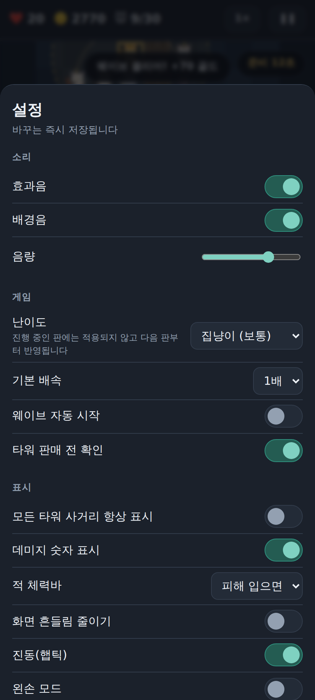

# 🐾 캣포 디펜스 (Catpaw Defense)

고양이 다섯 마리로 집을 지키는 타워디펜스. **HTML5 Canvas + PWA + 안드로이드 WebView 앱.**

의존성 0개 — 게임 코드는 순수 바닐라 JS ES 모듈이고, 이미지·오디오 파일이 하나도 없다.
고양이와 해충은 캔버스 도형으로, 효과음과 배경음은 WebAudio 오실레이터로 그 자리에서 만들어낸다.

| 타이틀 | 전투 | 설정 |
|---|---|---|
|  |  |  |

---

## 실행하는 3가지 방법

### 1) 웹에서 바로 (가장 빠름)

```bash
npx --yes http-server web -p 8080 -c-1
# → http://localhost:8080
```

`file://`로 직접 열면 안 된다 — ES 모듈이 CORS로 막힌다. 반드시 HTTP로 서빙해야 한다.

### 2) 폰에 앱처럼 설치 (PWA)

위 서버를 폰과 같은 네트워크에서 띄우거나 GitHub Pages 등에 올린 뒤,
안드로이드 크롬에서 열고 **⋮ → 홈 화면에 추가**.

- 전체화면·세로 고정으로 실행된다 (주소창 없음)
- 서비스 워커가 모든 파일을 캐시해서 **비행기 모드에서도 그대로 돌아간다**

### 3) 진짜 APK

**GitHub Actions로 (권장 — 아무것도 설치할 필요 없음)**
`main`이나 아무 브랜치에 푸시하면 CI가 APK를 빌드한다.
Actions 탭 → 최신 실행 → Artifacts에서 `catpaw-defense-debug-apk` 다운로드 → 폰에 설치.
디버그 키로 서명돼 있어 "출처를 알 수 없는 앱 설치"만 허용하면 바로 깔린다.

**Android Studio로**
`android/` 폴더를 열고 Run. 또는 명령줄에서:

```bash
cd android
./gradlew assembleDebug
# → app/build/outputs/apk/debug/app-debug.apk
```

`web/` 폴더는 빌드할 때마다 Gradle이 자동으로 assets에 복사한다. 웹 코드를 고치면 APK에 그대로 반영된다.

---

## 게임 규칙

목숨 20개로 시작한다. 해충이 길 끝까지 도달하면 목숨이 줄고, 0이 되면 진다. **30웨이브를 모두 막으면 승리.**

### 고양이 5종 (각 3레벨, 판매 시 투자금 60% 환급)

| 고양이 | 건설 | 특징 |
|---|---|---|
| 🧀 **치즈냥** | 80 | 빠른 연사. 싸고 무난하지만 두꺼운 장갑엔 힘을 못 쓴다 |
| 🎨 **삼색냥** | 160 | 헤어볼 폭발로 주변까지 타격. **지상만** — 박쥐를 못 잡는다 |
| 💙 **샴냥** | 130 | 눈빛으로 최대 65% 둔화. 피해는 약하지만 시간을 벌어준다 |
| 🖤 **검은냥** | 240 | 사거리 6칸 저격. **중장갑을 뚫는 유일한 답** |
| ⬜ **뚱냥** | 200 | 사거리 안 **전체**를 동시 타격. 적이 뭉칠수록 무섭다 |

### 해충 6종

| 해충 | 체력 | 특징 |
|---|---|---|
| 생쥐 | 32 | 기본 |
| 바퀴 | 26 | 매우 빠르고 떼로 온다 |
| 시궁쥐 | 95 | 방어 2 |
| 박쥐 | 62 | **공중** — 삼색냥 무효 |
| 두더지 | 240 | **방어 8**, 둔화 저항 50% |
| 쥐왕 👑 | 1400 | 보스. 뚫리면 **목숨 5개** |

### 핵심 규칙

**피해량 = max(1, 공격력 − 방어력)**

이것 때문에 치즈냥(공격 12)은 두더지(방어 8) 앞에서 4밖에 못 넣는다. 속사로 다 되지 않는다.

### 그 외

- 맵 3종 — 골목길 → 부엌 → 지붕. 클리어하면 다음 맵이 열린다
- 난이도 3단계 (아깽이 / 집냥이 / 길냥이) — 설정에서 변경
- 타워마다 표적 우선순위 4종 (선두 / 후미 / 강력 / 근접) 전환
- 1× / 2× / 3× 배속
- 준비 시간을 남기고 웨이브를 먼저 호출하면 **조기 호출 보너스** 골드

---

## 프로젝트 구조

```
web/js/domain/     DOM을 전혀 모르는 순수 로직 — node --test 대상
web/js/content/    고양이·적·맵·웨이브·능력 데이터 + 레지스트리
web/js/           sprites / render / game / ui / audio / main
tests/node/        단위 테스트 (의존성 0, node 내장 러너)
tools/             아이콘 생성기, 헤드리스 실행 검증기
android/           Kotlin + WebView 래퍼 (APK 소스)
docs/확장가이드.md  ★ 새 고양이·적·맵·설정 추가하는 법
```

**모든 콘텐츠가 데이터다.** 새 고양이 한 마리를 추가할 때 `game.js`/`render.js`/`ui.js`를 건드리지 않는다.
자세한 방법은 [`docs/확장가이드.md`](docs/확장가이드.md).

부팅할 때 `validateAll()`이 참조 무결성(미등록 스프라이트·효과·적·웨이브셋, 성립하지 않는 경로)을
전부 검사하므로, 잘못 추가한 콘텐츠는 조용히 깨지지 않고 한국어 에러로 즉시 드러난다.

---

## 개발

```bash
npm test     # 단위 테스트 (node --test, 의존성 0)
npm run serve  # 로컬 서버
```

**실행 검증** (헤드리스 크로미움으로 실제 조작 + 스크린샷, playwright 필요):

```bash
NODE_PATH=/opt/node22/lib/node_modules node tools/screenshot.mjs
# → tools/out/*.png, 콘솔 에러가 1건이라도 있으면 실패로 끝난다
```

**아이콘 다시 만들기** (`web/icons/icon.svg`를 고친 뒤):

```bash
NODE_PATH=/opt/node22/lib/node_modules node tools/make-icons.mjs
```
